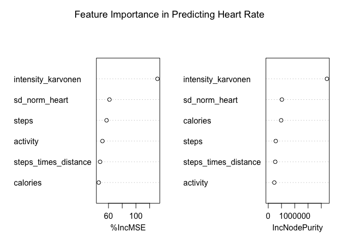

Wearable Health Data Analysis
================
Dr. R. Craig Stillwell

## Introduction

This report presents a comprehensive data analysis using wearable health
data from Apple Watch and Fitbit. The analysis includes data
preparation, clustering to identify user patterns, and predictive
modeling to classify activity types and predict heart rate. The insights
derived from this analysis can inform device improvements, user
engagement, and personalized health recommendations.

## Data Preparation

``` r
# Load the dataset
data <- read.csv('data/aw_fb_data.csv')

# Initial data check
str(data)
```

    ## 'data.frame':    6264 obs. of  20 variables:
    ##  $ X                   : int  1 2 3 4 5 6 7 8 9 10 ...
    ##  $ X1                  : int  1 2 3 4 5 6 7 8 9 10 ...
    ##  $ age                 : int  20 20 20 20 20 20 20 20 20 20 ...
    ##  $ gender              : int  1 1 1 1 1 1 1 1 1 1 ...
    ##  $ height              : num  168 168 168 168 168 168 168 168 168 168 ...
    ##  $ weight              : num  65.4 65.4 65.4 65.4 65.4 65.4 65.4 65.4 65.4 65.4 ...
    ##  $ steps               : num  10.8 11.5 12.2 12.9 13.6 ...
    ##  $ hear_rate           : num  78.5 78.5 78.5 78.6 78.7 ...
    ##  $ calories            : num  0.345 3.288 9.484 10.155 10.825 ...
    ##  $ distance            : num  0.00833 0.0089 0.00947 0.01004 0.0106 ...
    ##  $ entropy_heart       : num  6.22 6.22 6.22 6.22 6.22 ...
    ##  $ entropy_setps       : num  6.12 6.12 6.12 6.12 6.12 ...
    ##  $ resting_heart       : num  59 59 59 59 59 59 59 59 59 59 ...
    ##  $ corr_heart_steps    : num  1 1 1 1 0.983 ...
    ##  $ norm_heart          : num  19.5 19.5 19.5 19.6 19.7 ...
    ##  $ intensity_karvonen  : num  0.139 0.138 0.139 0.139 0.14 ...
    ##  $ sd_norm_heart       : num  1 1 1 1 0.242 ...
    ##  $ steps_times_distance: num  0.0897 0.1021 0.1153 0.1293 0.1441 ...
    ##  $ device              : chr  "apple watch" "apple watch" "apple watch" "apple watch" ...
    ##  $ activity            : chr  "Lying" "Lying" "Lying" "Lying" ...

``` r
summary(data)
```

    ##        X              X1              age            gender      
    ##  Min.   :   1   Min.   :   1.0   Min.   :18.00   Min.   :0.0000  
    ##  1st Qu.:1567   1st Qu.: 789.8   1st Qu.:23.00   1st Qu.:0.0000  
    ##  Median :3132   Median :1720.0   Median :28.00   Median :0.0000  
    ##  Mean   :3132   Mean   :1771.1   Mean   :29.16   Mean   :0.4765  
    ##  3rd Qu.:4698   3rd Qu.:2759.2   3rd Qu.:33.00   3rd Qu.:1.0000  
    ##  Max.   :6264   Max.   :3670.0   Max.   :56.00   Max.   :1.0000  
    ##      height          weight           steps           hear_rate      
    ##  Min.   :143.0   Min.   : 43.00   Min.   :   1.00   Min.   :  2.222  
    ##  1st Qu.:160.0   1st Qu.: 60.00   1st Qu.:   5.16   1st Qu.: 75.598  
    ##  Median :168.0   Median : 68.00   Median :  10.09   Median : 77.268  
    ##  Mean   :169.7   Mean   : 69.61   Mean   : 109.56   Mean   : 86.142  
    ##  3rd Qu.:180.0   3rd Qu.: 77.30   3rd Qu.: 105.85   3rd Qu.: 95.669  
    ##  Max.   :191.0   Max.   :115.00   Max.   :1714.00   Max.   :194.333  
    ##     calories           distance        entropy_heart   entropy_setps  
    ##  Min.   : 0.05627   Min.   :  0.0004   Min.   :0.000   Min.   :0.000  
    ##  1st Qu.: 0.73587   1st Qu.:  0.0191   1st Qu.:6.109   1st Qu.:5.909  
    ##  Median : 4.00000   Median :  0.1817   Median :6.190   Median :6.157  
    ##  Mean   :19.47182   Mean   : 13.8326   Mean   :6.030   Mean   :5.740  
    ##  3rd Qu.:20.50000   3rd Qu.: 15.6972   3rd Qu.:6.248   3rd Qu.:6.248  
    ##  Max.   :97.50000   Max.   :335.0000   Max.   :6.476   Max.   :6.476  
    ##  resting_heart    corr_heart_steps    norm_heart      intensity_karvonen 
    ##  Min.   :  3.00   Min.   :-1.0000   Min.   :-76.000   Min.   :-2.714286  
    ##  1st Qu.: 58.13   1st Qu.:-0.4673   1st Qu.:  1.149   1st Qu.: 0.009819  
    ##  Median : 75.00   Median : 0.6658   Median :  9.820   Median : 0.079529  
    ##  Mean   : 65.87   Mean   : 0.3064   Mean   : 20.272   Mean   : 0.155479  
    ##  3rd Qu.: 76.14   3rd Qu.: 1.0000   3rd Qu.: 27.077   3rd Qu.: 0.211868  
    ##  Max.   :155.00   Max.   : 1.0000   Max.   :156.319   Max.   : 1.297980  
    ##  sd_norm_heart     steps_times_distance    device            activity        
    ##  Min.   : 0.0000   Min.   :    0.00     Length:6264        Length:6264       
    ##  1st Qu.: 0.2647   1st Qu.:    0.66     Class :character   Class :character  
    ##  Median : 2.8935   Median :   13.37     Mode  :character   Mode  :character  
    ##  Mean   : 8.1108   Mean   :  590.04                                          
    ##  3rd Qu.: 9.6797   3rd Qu.:   93.73                                          
    ##  Max.   :74.4579   Max.   :51520.00

``` r
# Data Cleaning
data <- data %>%
  select_if(~ !all(is.na(.))) %>%  # Remove columns with all missing values
  mutate(activity = as.character(activity)) %>%
  drop_na(activity)                # Drop rows with NA in 'activity'

# Save cleaned data
write.csv(data, file = "/Users/stillwell/Documents/R/Apple Watch and Fitbit Health Data Portfolio/data/cleaned_aw_fb_data.csv")
```

## Clustering Analysis

We use K-means clustering to explore distinct patterns in heart rate and
step count, identifying user groups with similar health metrics.

``` r
# Select relevant columns and normalize data for clustering
clustering_data <- data %>%
  select(hear_rate, steps, resting_heart)
clustering_data_normalized <- scale(clustering_data)

# Determine the optimal number of clusters using the silhouette method
fviz_nbclust(clustering_data_normalized, kmeans, method = "silhouette") +
  labs(title = "Optimal Number of Clusters (Silhouette Method)")
```

<!-- -->

The silhouette method suggests an optimal cluster count of four,
indicating distinct user profiles, which could represent lifestyle
patterns (e.g., sedentary or moderately active) and health states.

``` r
# Perform K-means clustering and add results to data
set.seed(123)
kmeans_result <- kmeans(clustering_data_normalized, centers = 4, nstart = 25)
data$cluster <- as.factor(kmeans_result$cluster)

# Visualize clustering results
ggplot(data, aes(x = steps, y = hear_rate, color = cluster, shape = activity)) +
  geom_point(alpha = 0.7, size = 3) +
  theme_minimal(base_size = 15) +
  labs(title = "K-Means Clustering of Heart Rate Patterns",
       subtitle = "Identifying Patterns in Wearable Data Using K-Means Clustering",
       x = "Steps",
       y = "Heart Rate") +
  scale_color_brewer(palette = "Set1") +
  theme(legend.position = "bottom", plot.title = element_text(hjust = 0.5, face = "bold"),
        plot.subtitle = element_text(hjust = 0.5))
```

<!-- -->

## Predictive Modeling

### Model 1: Predicting Heart Rate

A Random Forest model predicts heart rate using key metrics such as
steps, calories, and intensity.

``` r
# Feature selection and train-test split
features <- data %>%
  select(steps, calories, intensity_karvonen, sd_norm_heart, steps_times_distance, activity, hear_rate) %>%
  drop_na()
features$activity <- as.factor(features$activity)
set.seed(123)
trainIndex <- createDataPartition(features$hear_rate, p = 0.8, list = FALSE)
train_data <- features[trainIndex, ]
test_data <- features[-trainIndex, ]

# Train a Random Forest model for heart rate prediction
rf_model_hr <- randomForest(hear_rate ~ ., data = train_data, importance = TRUE)
predictions_hr <- predict(rf_model_hr, newdata = test_data)
rmse_value <- rmse(test_data$hear_rate, predictions_hr)
r2_value <- cor(test_data$hear_rate, predictions_hr)^2

# Print results
cat("Root Mean Square Error (RMSE):", rmse_value, "\n")
```

    ## Root Mean Square Error (RMSE): 9.361865

``` r
cat("R-squared:", r2_value, "\n")
```

    ## R-squared: 0.895882

``` r
varImpPlot(rf_model_hr, main = "Feature Importance in Predicting Heart Rate")
```

<!-- -->

The model achieved an RMSE of 9.362 and an R² of 0.8959, demonstrating
that heart rate can be effectively predicted from activity metrics. This
information could improve device algorithms for health tracking.

### Model 2: Classifying Activity Type

We use a Random Forest classifier to identify activity types, offering
real-time feedback on workout intensity.

``` r
# Train a Random Forest model for activity classification
rf_model_activity <- randomForest(activity ~ ., data = train_data, importance = TRUE)
predictions_activity <- predict(rf_model_activity, newdata = test_data)
conf_matrix_activity <- confusionMatrix(predictions_activity, test_data$activity)
print(conf_matrix_activity)
```

    ## Confusion Matrix and Statistics
    ## 
    ##                 Reference
    ## Prediction       Lying Running 3 METs Running 5 METs Running 7 METs
    ##   Lying            233             13              8              2
    ##   Running 3 METs    22            170              4              0
    ##   Running 5 METs     3              6            167              8
    ##   Running 7 METs     5              1             13            173
    ##   Self Pace walk     4              5              3              1
    ##   Sitting           19              2              4             10
    ##                 Reference
    ## Prediction       Self Pace walk Sitting
    ##   Lying                       9      21
    ##   Running 3 METs              4       2
    ##   Running 5 METs              6      11
    ##   Running 7 METs              5      18
    ##   Self Pace walk            151       7
    ##   Sitting                     9     133
    ## 
    ## Overall Statistics
    ##                                           
    ##                Accuracy : 0.8203          
    ##                  95% CI : (0.7979, 0.8412)
    ##     No Information Rate : 0.2284          
    ##     P-Value [Acc > NIR] : <2e-16          
    ##                                           
    ##                   Kappa : 0.7831          
    ##                                           
    ##  Mcnemar's Test P-Value : 0.1694          
    ## 
    ## Statistics by Class:
    ## 
    ##                      Class: Lying Class: Running 3 METs Class: Running 5 METs
    ## Sensitivity                0.8147                0.8629                0.8392
    ## Specificity                0.9451                0.9697                0.9677
    ## Pos Pred Value             0.8147                0.8416                0.8308
    ## Neg Pred Value             0.9451                0.9743                0.9696
    ## Prevalence                 0.2284                0.1573                0.1589
    ## Detection Rate             0.1861                0.1358                0.1334
    ## Detection Prevalence       0.2284                0.1613                0.1605
    ## Balanced Accuracy          0.8799                0.9163                0.9035
    ##                      Class: Running 7 METs Class: Self Pace walk Class: Sitting
    ## Sensitivity                         0.8918                0.8207         0.6927
    ## Specificity                         0.9603                0.9813         0.9585
    ## Pos Pred Value                      0.8047                0.8830         0.7514
    ## Neg Pred Value                      0.9797                0.9695         0.9451
    ## Prevalence                          0.1550                0.1470         0.1534
    ## Detection Rate                      0.1382                0.1206         0.1062
    ## Detection Prevalence                0.1717                0.1366         0.1414
    ## Balanced Accuracy                   0.9260                0.9010         0.8256

``` r
varImpPlot(rf_model_activity, main = "Feature Importance in Predicting Activity Type")
```

<!-- -->

The confusion matrix displays correct and incorrect predictions for each
activity type, showing high accuracy, especially for high-intensity
activities. This classification model helps improve activity tracking
and distinguish between similar activity types.

## Conclusion

This analysis demonstrates how wearable health data can reveal patterns
in user activity and predict key metrics like heart rate. These insights
can support the development of personalized health recommendations and
improve wearable technology.
